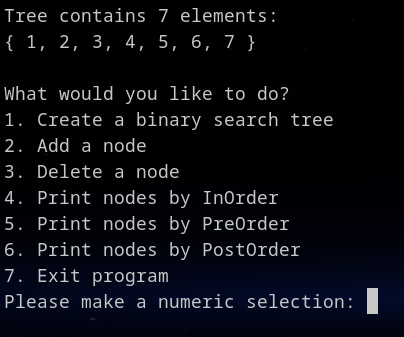

# Java-AVL-Tree

AVL Tree in Java for Study.com CS:201 course. [Computer Science 201: Data Structures & Algorithms](https://study.com/academy/course/computer-science-201-data-structures.html)

## Note to the Reviewer

I'm a bit confused by the instructions following `7. Exit program` in the Assignment Prompt.  I hesitate to copy/paste it here since it's not viewable without a subscription, but the bold text stating **keep the binary search tree balanced at all times** and the image after adding { 1, 2, 3, 4, 5, 6, 7 } per the instructions showing the tree in a balanced state led me to an AVL Tree.  I hope this is acceptable...

## Program Specifications

#### The program specifications listed here are publicly available at [Study.com](https://study.com/academy/lesson/data-structures-algorithms-assignment-array-sorting-and-hashmaps.html)

- Develop the program for the Windows Operating System.
- Include a user interface allowing a user to interact with the binary search tree.
- When a user runs the application, it displays a menu and prompts the user to select an option.
- The menu options are:

1. Create a binary search tree
1. Add a node
1. Delete a node
1. Print nodes by InOrder
1. Print nodes by PreOrder
1. Print nodes by PostOrder
1. Exit program

## Comments

The utterly insane amount of comments are required by the course rubric and are not reflective of my coding style.

## Demo Screenshots

## Building and Running

1. Clone the repository: `git clone https://github.com/AustinBachurski/Java-AVL-Tree.git`
1. Change to the source directory: `cd Java-AVL-Tree/src`
1. Compile the code and write files to an out directory: `javac -d out Main.java`
1. Change to the out directory: `cd out`
1. Run the application: `java Main`

